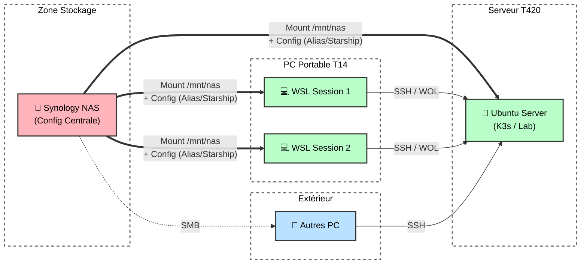

# Architecture du Lab SRE

```mermaid
graph LR
    %% --- Styles ---
    classDef storage fill:#ffb3ba,stroke:#333,stroke-width:2px,color:black;
    classDef container fill:none,stroke:#666,stroke-width:2px,stroke-dasharray: 5 5,color:black;
    classDef logic fill:#baffc9,stroke:#333,stroke-width:2px,color:black;
    classDef external fill:#bae1ff,stroke:#333,stroke-width:2px,color:black;

    %% --- Nodes & Groups ---
    subgraph NAS_Zone ["Zone Stockage"]
        direction TB
        NAS["💾 Synology NAS<br/>(Config Centrale)"]:::storage
    end

    subgraph T14_Zone ["PC Portable T14"]
        direction TB
        WSL1["💻 WSL Session 1"]:::logic
        WSL2["💻 WSL Session 2"]:::logic
    end

    subgraph T420_Zone ["Serveur T420"]
        direction TB
        USrv["🚀 Ubuntu Server<br/>(K3s / Lab)"]:::logic
    end
    
    subgraph Ext_Zone ["Extérieur"]
        Other["📱 Autres PC"]:::external
    end

    %% --- Connections ---
    
    %% Flux de Configuration (Le plus important)
    NAS == "Mount /mnt/nas<br/>+ Config (Alias/Starship)" ==> WSL1
    NAS == "Mount /mnt/nas<br/>+ Config (Alias/Starship)" ==> WSL2
    NAS == "Mount /mnt/nas<br/>+ Config (Alias/Starship)" ==> USrv
    
    %% Accès Fichiers simple
    NAS -.->|SMB| Other

    %% Gestion / Contrôle
    WSL1 -->|SSH / WOL| USrv
    WSL2 -->|SSH / WOL| USrv
    Other -->|SSH| USrv

    %% Styling des conteneurs physiques
    class NAS_Zone,T14_Zone,T420_Zone,Ext_Zone container;
```
